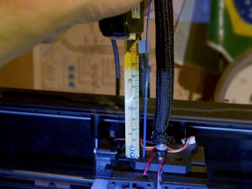
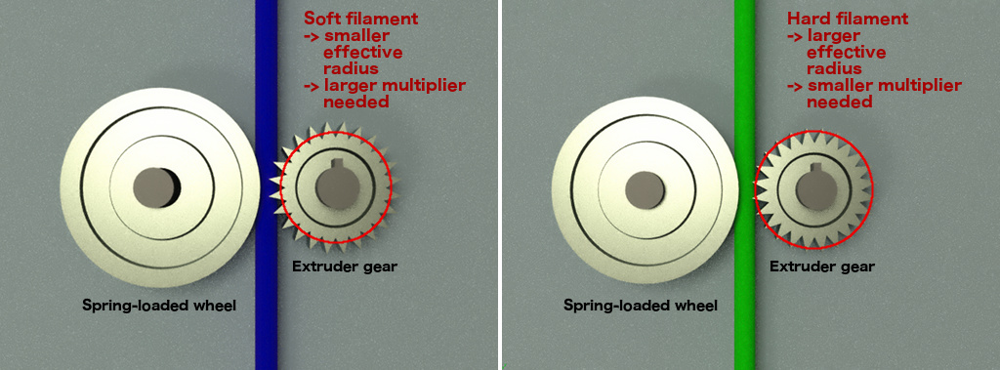

# 100mm extrusion calibration for FlashForge Creator Pro
*Files to determine the extrusion multiplier for a given filament (formerly thing:2440657)*

### License
[Creative Commons - Attribution](https://creativecommons.org/licenses/by/4.0/)

[🔎](images/calibration.jpg) 

## Description

Depending on how soft 3D printing filament is, your printer will extrude a different length of filament than you ask it to. The reason is explained in detail below. The remedy is to apply an *extrusion multiplier.* This repository provides files and a workflow that allow to determine an appropriate extrusion multiplier (abbreviated here as EM) for any given filament.

These are ready-to-use X3G files for the FlashForge Creator Pro and similar printers, to perform the [calibration procedure as explained on the MatterHackers site](http://www.matterhackers.com/articles/how-to-calibrate-your-extruder). The files will instruct the printer to extrude exactly 100 mm of filament. Ideally this will result in exactly 100 mm of filament going into the extruder, but in practice it will usually be less, and to get accurate results while making actual prints, an *extrusion multiplier* must be applied to compensate for this.
 

## How to use

### Preparation

Do not simply load the filament of which you want to measure the extrusion multiplier. Instead, cut a strand off the spool. To allow doing the test twice as recommended, take a strand at least 260 mm long. Load this strand into the extruder without the guide tube such that it simply sticks out from the top of the extruder carriage (as shown in the photo). You must now have at least 200 mm of filament sticking out from the top of the carriage, preferably slightly more. You don't need to push the filament as deep as it can go, it suffices that it is inside the hot-end tube.

Next, hold the strand vertically and either mark a reference point on it, or just take the end of the strand as the reference point. Measure the distance between the top of the carriage and this reference point. This distance must be at least 100 mm (preferably a bit more). Keep the filament straight while measuring, but be careful not to stretch elastic filaments to avoid an incorrect measurement. Write down this distance.

There are two sets of files, regular and slow. The regular ones are suitable for the more common materials like PLA, ABS, or PETG. The slow ones are recommended for TPU or other soft filaments. Pick the x3g file from for the appropriate set and desired extruder (left or right) and temperature.

### ‘Printing’

Leave the build platform at the bottom of the printer, its only purpose in this test will be to catch the spiral of extruded filament. I have only tested this from an SD card. Printing from USB should work as well, but I give no guarantees.

Now ‘print’ the file you selected. The temperature is not crucial, pick a temperature close to the one you'll be using for printing with this filament. The LCD display will prompt to press OK when the extruder is at temperature. From then on, it takes less than 2 minutes to complete for the regular speed files, about 4 minutes for the slow files.

The carriage will move in a square pattern during the test, this is both a necessity to reliably extrude the correct length of material, and it has the nice side effect of coiling up the extruded strand.
Don't mind the weird zig-zag dance at the end, this is to ensure the file has enough commands to avoid confusing messages on the LCD display. At the end, the display must show the extrusion counter at exactly 0.100 m because that is what the printer believes to have extruded.

### Calculating the EM

When it has finished, again measure the distance between the top of the carriage and your reference point (or end of the strand). Subtract this new distance from the one you measured before. The extrusion multiplier is this difference (in millimeters) divided by 100.

For instance, if you initially marked 110 mm and the final distance is 17 mm, the printer consumed 110 - 17 = 93 mm. This means your extrusion multiplier should be 100/93 = 1.0753.
Other example: the initial length of filament sticking out above the carriage was 120 mm and the final length is 17 mm. The extrusion multiplier should therefore be: 100 / (120 - 17) = 100/103 = 0.9709. (This is an unlikely scenario because most manufacturers will tune the extruder steps such that the hardest filaments will have an EM of 1.00.)

For PLA and ABS, the extrusion multiplier should be very close to 1.00. For PETG it can be slightly higher, like 1.03. The softer the filament, the higher the multiplier should be (see explanation below). A flexible filament like NinjaFlex should yield a multiplier around 1.10. Anything far above that, is probably an indication that something went wrong, probably the extruder skipping due to too low temperature or too fast extrusion.

## Remarks

You should do the test at least **twice** with the same filament to check consistency of the result (this is why you should start with a strand of at least 260mm). If the results of the two tests deviate a lot, it may be an indication that something went wrong. If a third test yields yet another different result, repeat the test with the ‘slow’ files. If you still get wildly varying results with the slow files, check extrusion temperature and ensure your nozzle is clean and the extruder gears aren't clogged with remains of filament.

If you need test files with an even slower extrusion rate than the ones I provide, just ask.

In theory the test must be repeated for every different filament, but you can probably safely assume that different colors of the same material from the same brand will yield the same results.

Mind that you cannot re-print the test files with your calculated multiplier. This would require making new X3G files, and it would be pretty pointless anyway if you correctly measured and calculated everything. The goal is to use the EM in your slicing program while making actual prints.

It is not essential to get the extrusion multiplier correct to umpteen digits after the decimal point. In fact, from this test I found out that I had been under- or over-extruding certain filaments for a long time, yet my prints were accurate and reliable. In the end, use the multiplier that provides the best results in practice, not in theory.

This method will only compensate for the difference in expected versus actual extruded length. As explained below, it does not compensate for incorrect filament diameter because that is not the purpose of the extrusion multiplier.

Last but not least, do not keep extruding until the strand of filament disappears into the extruder and it runs out of material. Unless you're lucky and can push the strand down the tube with another strand, the only way to get out of this situation is to disassemble the extruder down to the hot-end, not my idea of fun.
 

### Note about used material estimates

Some slicing programs, like Slic3r and PrusaSlicer at the time of this writing, will include the extrusion multiplier in their estimates of used material for a print. **This is wrong.** From the explanation below, it should be obvious that the only purpose of the EM is to correct for a mismatch between the length of filament the printer is expected to consume, and what it actually consumes. Once the multiplier is correctly configured, the printer will extrude exactly the length and weight of filament that can be calculated from the filament diameter and density, and nothing more.
Please vote or comment on [Slic3r issue #4087](https://github.com/slic3r/Slic3r/issues/4087) to ask to fix this bug, and file a bug for other slicing programs if you notice they make this same mistake.

If for some reason you want to deliberately over- or under-extrude, do not fiddle with the extrusion multiplier. Instead, respectively lower or raise the filament diameter in your slicing program.

## Why is the extrusion multiplier needed?

To begin with, the extrusion multiplier is **not a fudge factor** to compensate for a mismatch between the filament diameter the manufacturer printed on the filament spool and the actual filament diameter. The filament diameter will almost *never* be exactly 1.75 mm or 2.85 mm. It is essential that you measure the actual filament diameter of every spool you use, and enter this value in your slicer's filament profile. If you do not have an accurate caliper or micrometer, buy one. Only then does it make any sense to accurately determine the extrusion multiplier. Good quality spools will have a consistent diameter from start to end. For low-quality spools, you may need to re-measure the diameter regularly.

*Then what does the extrusion multiplier really mean?*

Most extruder designs rely on a geared wheel that pushes against another spring-loaded wheel. The teeth of the gear provide a good grip on the filament clamped in between the two wheels. However, the softer the material, the deeper the teeth will dig into the filament and the smaller the effective radius of the driving gear becomes. To extrude a certain length of filament, a gear with a smaller effective radius will need to make more turns than one with a larger radius.

Your printer's firmware is configured with some reasonable default conversion factor between extrusion coordinates in print commands and the number of motor steps required to pull the instructed length of filament through the extruder. This default was chosen for some typical filament and will not be correct for a softer or harder filament. This is where the extrusion multiplier is needed.

There can be other factors affecting the extrusion multiplier. For instance for an elastic filament in a direct drive extruder, the mere force of the extruder pulling on the segment between the spool and the extruder gear, can stretch this segment and effectively reduce its diameter. (For a bowden extruder it could be the other way round because the filament is being pushed.) This is why for very elastic filaments, you may need to use a multiplier even larger than the one resulting from this calibration procedure which does not take this effect into account. Although I do not recommend using a low-friction spool mount for rigid filaments, for elastic filaments it does make sense because it helps to minimize this effect.

Some firmwares allow to send a command with the multiplier which is then automatically applied to all coordinates. Sailfish (as used by the FFCP) however does not allow this, therefore the extrusion coordinates themselves must already be multiplied before sending them to the printer.

As stated above, the extrusion multiplier must play no role in the calculation of material needed for a particular print. The only role of the EM is to ensure the amount of extruded material matches the amount we want the printer to extrude.

## Updates

### 2017/07/18

First upload to Thingiverse.

### 2018/07/29

Doubled the distance travelled per print move, because the extrusion rate per mm seemed too high and this caused exaggerated extrusion multiplier estimates. This should also make the extrusion slow enough for most flexible filaments. Also fixed problem of heaters staying enabled at the end.

### 2020/02/03

Re-generated all files with much slower extrusion, because the previous files were still extruding way too fast even for normal filaments, making them basically useless. Make sure to replace all your files. The extrusion rate is now roughly equivalent to 15 mm/s print moves with a 0.6 mm extrusion width at 0.3 mm layer height. It is unlikely that you'll encounter a filament for which this is still too fast.
Also ensured that the progress indicator on the LCD shows useful values.

### 2020/03/07

Added ‘slow’ files because even the new files were still too fast to get reliable results with soft TPU like NinjaFlex. These new files run at almost half the speed of the other ones. If this still produces wildly varying results with a certain filament, it is probably pretty hopeless to print reliably with it…

## Tags
`calibration`, `extruder_calibration`, `extrusion_multiplier`, `FFCP`, `FFCPRo`, `MatterHackers`, `printer_calibration`
